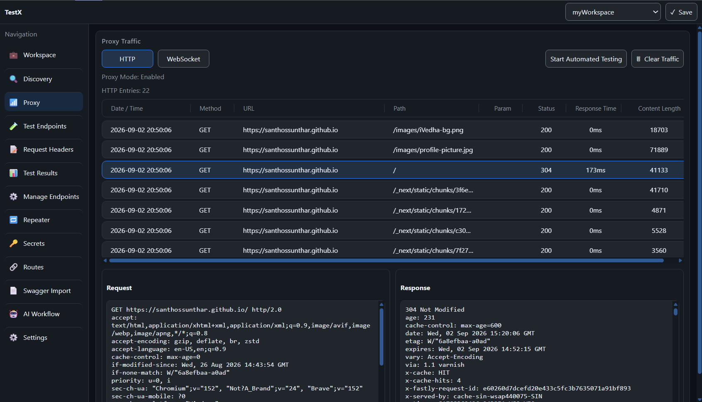

<p align="center">
  <h1 align="center">TestX</h1>

  <p align="center">
    Chrome DevTools extension for API discovery, proxy-style traffic inspection, endpoint testing, and workflow automation.
  </p>
</p>

## Table of contents
- [About The Project](#about-the-project)
- [Features](#features)
- [Prerequisites](#prerequisites)
- [Getting Started](#getting-started)
- [Security And Privacy Notes](#security-and-privacy-notes)
- [Contributing](#contributing)
- [Contact](#contact)
- [License](#license)

## About The Project

TestX is a Chrome DevTools panel that helps developers inspect web applications, discover API endpoints, capture runtime traffic, and test requests from inside DevTools.

The extension adds a custom `TestX` tab to Chrome DevTools. From that panel you can organize workspaces, discover endpoints from the inspected site, import OpenAPI/Swagger definitions, configure request headers and secrets, replay requests in a repeater, and run optional AI-assisted workflows.

<p align="center">
  
</p>

## Features

- Custom Chrome DevTools panel named `TestX`.
- Workspace support for separating routes, discovered endpoints, secrets, request headers, and discovery settings.
- Passive API discovery from runtime network traffic.
- Proxy Mode for broader HTTP and WebSocket request capture while navigating an app.
- Endpoint management with grouping, editing, and route promotion.
- Manual route builder and request sender with response headers/body output.
- Repeater for replaying and editing captured or discovered requests.
- OpenAPI/Swagger import from URL or pasted JSON/YAML.
- Credential-assisted discovery for sign-in or sign-up flows, including optional manual OTP/verification continuation.
- Automated endpoint testing with local security checks and optional AI-generated security analysis.
- Per-domain secrets that can be applied as headers or query parameters.
- AI workflow generation and execution through OpenAI, Anthropic, Groq, or a custom OpenAI-compatible HTTPS endpoint.
- Light and dark theme support.

## Prerequisites

- [Node.js](https://nodejs.org/) 18 or newer.
- [Google Chrome](https://www.google.com/chrome/) or another Chromium-based browser with extension developer mode.
- `npm`, included with Node.js.

## Getting Started

### Build

1. Clone this repository.

```sh
git clone https://github.com/santhossunthar/TextX.git
cd TextX
```

2. Install dependencies.

```sh
npm install
```

3. Build the extension.

```sh
npm run build
```

4. For development, run Vite in watch mode.

```sh
npm run dev
```

`npm run dev` builds in development mode and keeps the `Dev Refresh` button visible in the DevTools panel. `npm run build` builds in production mode and removes that development-only refresh control from `dist/panel.html`.

### Load in Chrome

1. Open `chrome://extensions`.
2. Enable `Developer mode`.
3. Click `Load unpacked`.
4. Select the `dist` folder generated by the build.
5. Open any website.
6. Open DevTools with `F12` or `Ctrl+Shift+I`.
7. Select the `TestX` tab.

### Recommended Workflow

1. Create or select a workspace.
2. Set the target site base URL in `Discovery`.
3. Enable passive discovery or Proxy Mode.
4. Navigate through the inspected site to collect endpoints.
5. Review endpoints in `Manage Endpoints` or `Test Endpoints`.
6. Configure request headers and secrets when authenticated requests are required.
7. Send interesting requests to `Repeater` for manual testing.
8. Import Swagger/OpenAPI specs when available to seed routes quickly.
9. Configure AI settings only if you want AI-assisted endpoint discovery, workflow generation, or security analysis.

## Security And Privacy Notes

- TestX stores workspace data, routes, headers, secrets, and AI settings in browser storage for local development use.
- AI provider endpoints must use HTTPS. Built-in providers are allowlisted unless the custom endpoint override is enabled.
- Privacy mode redacts likely secrets before sending context to AI.
- Sending request headers or bodies to AI is disabled unless explicitly enabled.
- One-time key mode clears the AI key after each AI request.
- Console capture starts after the content script and page hook are injected, so very early page logs may be missed.

## Contributing

Contributions are welcome.

1. Fork the project.
2. Create your feature branch: `git checkout -b feature/your-feature-name`.
3. Commit your changes: `git commit -m "Add your feature"`.
4. Push to the branch: `git push origin feature/your-feature-name`.
5. Open a pull request.

## Contact

<p align="left">
  <a target="_blank" href="https://www.linkedin.com/in/santhossunthar/"></a>&nbsp;&nbsp;&nbsp;&nbsp;
</p>

Project Link: [https://github.com/santhossunthar/TextX](https://github.com/santhossunthar/TextX)

## License

Distributed under the MIT License. See [LICENSE](LICENSE) for more information.
